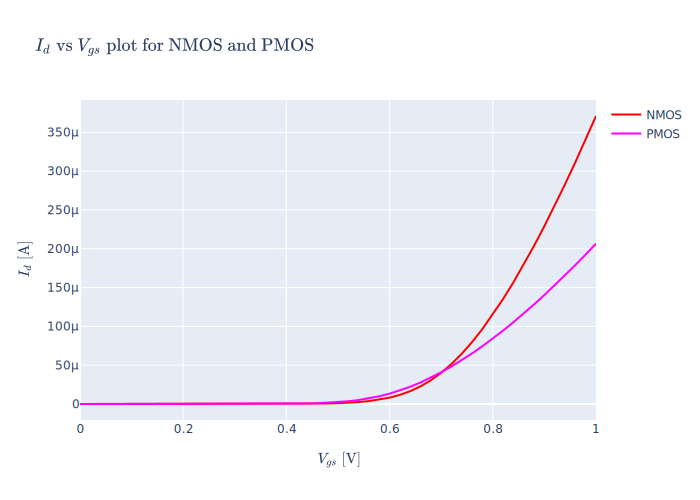

# Analog Daddy

## Motivation

This library shows Analog Design who the daddy is. Well, it's just *an attempt to make transistor sizing less painful*.
Additionally, it includes certain scripts and tools to make any aspect of Analog Design a little less painful.
Analog Design requires practice, intuition and experience. It isn't easy to design, power and area efficient
circuits for a given specification that are functional across PVT corners (process, voltage and temperature corners)
and for the functionality to closely correlate with real silicon data.
It is 'hard' and requires time.

However, as far as the transistor sizing for a given DC operating point goes, with ever evolving models,
, second and third order effects, square-law based pen and paper calculations to actual design convergence
have become more painful and sometimes require more iterations.
The lookup table based design methodology tries to find a middle ground.
You can read more about it in
[Systematic Design of Analog CMOS Circuits: Using Pre-Computed Lookup Tables by P.G.A. Jespers and B. Murmann, Cambridge University Press, 2017](https://www.cambridge.org/us/academic/subjects/engineering/circuits-and-systems/systematic-design-analog-cmos-circuits-using-pre-computed-lookup-tables?format=AR).

## Previous Work

The [Gm/Id starter kit by Prof. Boris Murmann et al.](https://github.com/bmurmann/Book-on-gm-ID-design)
is an excellent tool to get comfortable with gm/id methodology and use Lookup tables in general with whatever
design methodology you like. Thus, this kit could serve as an advanced calculator. The kit
is excellently written, but it is written in Matlab (and MATLAB sucks), but the gist is that if this tool/methodology
is going to be learned by new Analog Design engineers like me and taught in many other institutes, I would want them to use
Python in this fun venture. Additionally, my experience with interactive plotting capabilities of MATLAB has been subpar.

<details>
  <summary>Existing Toolkits</summary>

- [Analog Designer's Toolbox](https://adt.master-micro.com/): Maybe, I will eventually get bored of maintaining this library
   and using this polished tool for my day-to-day work, but I feel that there has to be some alternative for the hobbyists and
   enthusiasts to tinker with. The tool is closed-source and might be made for serious work. I would want this tool we are
   building to be polished and be used for serious work but also would want it open source for interested people to tinker
   with and a community to be built around it.

- [Fengqi Zhang’s gmIdNeoKit](https://github.com/fengqzHD/gmIdNeoKit): This modification improves upon the data generation process
  in MATLAB by adding the `-v7.3` flag which is essential for large databases and should be the default. Secondly, it
  provides a nice GUI to work with. However, for any modifications, I would have to learn pyQT5. I prefer using Jupyter
  Notebooks and accompanying widgets since it is easily shareable and presentable. Plus, I would prefer using interactive plotting
  from the very beginning using Plotly/Dash.

- [Ashwith Rego’s Python code (pyMOSchar)](https://github.com/ashwith/pyMOSChar): This by far is the closest to what I
  would want the tool to do. However, it is not modified for Python 3. Additionally, it used the binary reading of the
  PSF files, which was a pain in the ass to debug. Additionally, it does not support cross-ratio lookup. With all these
  different variants available, yet with certain shortcomings in each approach, I decided to start a more 'modern' and
  open implementation. But, thanks to these existing code-bases I don't have to reinvent the wheel and this serves
  as a good reference.

- [Mohamed Watfa's gmid toolkit in Python](https://github.com/medwatt/gmid): While I was trying to actively avoid writing
  the library, he has written something which works. A recent update made it possible for me to use `ngspice` binary
  directly for LUT generation and I now have a complete database of FreePDK45 devices. It took some basic scripting
  to make the LUT generated using the provided functions compliant with my LUT structure.  You can see the script
  I used for the conversion of the LUT [FreePDK45 LUT Generation](./docs/notebooks/freepdk_45nm_LUT_generation.ipynb).
  You can also directly [download the FreePDK45 LUT](https://github.com/siddhantladdha/freepdk45_lut/releases) that I
  generated using this method. Additionally, gmid toolkit got updated with new plots which look really beautiful!
  There are plotting templates provided in his toolkit, which support LateX formatting!

</details>

## Roadmap

I wrote this with high hopes that I will get motivated to write it. Turns out I really don't like to code. But an
awesome thing happened. ChatGPT! I am taking all the help from ChatGPT and whatever to avoid
writing the code myself. The results of such endaevours are well documented [here](./docs/chats_with_chatgpt.md)

The following are the key features in order of priority of them being implemented.

- [x] Thoroughly document the process of setting up custom Testbench (Cadence Virtuoso) and Expression setup in (Cadence Assembler).
- [x] Thoroughly documented code. (Tried my best to ask ChatGPT to document it.)
- [ ] Support for `lookupVGS` and corresponding test suite.
- [x] Packaging
  - [x] `pip` installable.
  - [x] ~Deployment on [pypi](https://pypi.org/) and `conda-forge`~. Needed?
- [x] Test suite for basic functions, so that upgrading libraries and dependency is easier.
- [x] Support lazy loading of the database file to improve speed and efficiency. I think using numpy already is the most efficient way to deal with this data.
- [x] Give templates for basic and interactive plotting using Plotly/Dash. See the [notebooks directory](./docs/notebooks)
- [x] Have basic plots and a template `.npy` file for ~[Skywater-130 nm PDK](https://github.com/google/skywater-pdk)~ ~GPDK~
      FreePDK45 for illustration and design purposes. I will not be using Skywater-130 nm PDK since a there is no version of
      PDK available to setup with Cadence for free. Instead, a derived data and plot of FreePDK45 will be shared here.
      The `GPDK45.npy` file will be slowly phased out from the test suite since it is useless with the smaller data points.
      However, its existence does not violate any licensing restrictions since this is derived data and and has smaller data points.

## Acknowledgements and Licensing

This library was created with extensive help of ChatGPT and White Claw Hard Seltzer. Both have helped equally in programming,
debugging and testing; with extra patience donated by White claw when ChatGPT refused to work for me.
Additionally, I have use few ideas from the previous work mentioned above. This work will be licensed as AGPLv3 since I would not
want anyone to monetize this and even if they do I want the changes to be given back to this tool's codebase.

One misconception for engineers in corporate environments is that if they modify the tool and distribute it internally
within their organization, they would have to make the source code public. My understanding is that If it (the tool modification)
is distributed over a network, the "users" which in your case would be your employees have the right
to request the source code, which is usually accessible to anyone within your organization. So you are all good to go and
use it even within your organization.
I would love to merge the changes you make to the tool and be public, but I understand that might not be entirely possible,
which is okay.

I would like to thank [Prof. Brian Floyd](https://bafloyd.wordpress.ncsu.edu/), who gave me a chance to explore
this design methodology in Spring 2021.
Special thanks to Bharadwaj Padmanabhan for helping in testbench creation and providing the relevant images.
I would also like to thank Gayathri Nair for helping me to generate the LUT for GPDK90
and for testing out the testbench on her own setup.

## Installation

### Online Installation for devices with internet access

If you are setting up Python for the first time, you need to install [miniconda](https://docs.conda.io/projects/miniconda/en/latest/)
by following the instructions [here](https://docs.conda.io/projects/miniconda/en/latest/). You can alternatively install
[Anaconda](https://www.anaconda.com/download/).
[Difference between Anaconda or Miniconda](https://stackoverflow.com/questions/45421163/anaconda-vs-miniconda)

After that you need to create what is called a conda environment.
For the examples below the name of my environment is "test_env".
Then we use [conda-forge](https://conda-forge.org/)

```bash
# create a test_env with the required configuration.
conda create --name test_env python=3.10 jupyterlab scipy numpy matplotlib dash pandas
conda config --add channels conda-forge
conda config --set channel_priority strict
conda activate test_env
```

Now you can install the package using the following.

```bash
# for online installation
pip install git+ssh://git@github.com/siddhantladdha/analog_daddy.git
```

To upgrade to the latest version you need to uninstall and re-install using the
following.
[Source](https://stackoverflow.com/questions/71356330/updating-pip-installed-package-from-git)

```bash
pip uninstall analog_daddy
pip install git+ssh://git@github.com/siddhantladdha/analog_daddy.git
```

### Offline installation for devices without internet access

Sometimes, the linux servers you design on at workplace have limited or no internet
access. Creating an offline installation of miniconda/conda and porting it to your
server is painful. The good news is if the IT department at your workplace is
competent, you might already have access to reasonably newer versions of the above
required libraries. In that case you can just clone this repository.

If there is no such provision in place I feel it is your right to file a JIRA ticket and
get such an installation working. (They can follow the online installation and set it up
for designers company wide.) However, do remember that they also have the right to refuse
to set it up. So the best course of action would be to use this on your local machine.
(Windows/Mac/Linux). You can then follow Online installation.

Or if the libraries are maintained and you still want to install it here is the command.
It is highly recommended you create a virtual environment and install it.

```bash
# for offline installation if you have installed the repository
pip install /path/to/your/local/git/repo
```

## Usage

- [Testbench Setup Instructions](./docs/notebooks/testbench_setup.ipynb)
- [Import Demo Jupyter Notebook](./docs/notebooks/import_demo.ipynb)
- [Usage Demo Jupyter Notebook](./docs/notebooks/usage_demo.ipynb)
- [Common Plots for gm_id based design Jupyter Notebook](./docs/notebooks/common_plots_gmid.ipynb)

A question I am asked often is that will I be providing a script to show an actual simple circuit design?
Short answer as of now **No**.

The long answer is that I am currently hesitant (and have been since the beginning I learnt this methodology)
to do this. The reason is that the temptation to just try out scripts without understanding is "human".
(Yes I am humanizing script kiddies). How do I know? I was one of the script kiddies! I used the scripts
from [this book by Prof. Murmann](https://www.cambridge.org/us/academic/subjects/engineering/circuits-and-systems/systematic-design-analog-cmos-circuits-using-pre-computed-lookup-tables?format=AR) without observing the tradeoffs for myself and directly using "optimization" scripts which is okay for simple
designs but a recipe for disaster in actual designs. Hence my current recommendation is following the first
point in additional resources section. Or atleast until I change my mind to share some 'scripts'

### Sample plots




## Testing and Packaging (For Developer use)

```python
python -m unittest discover tests
```

```bash
# run this command after any updates to make sure package is build correctly.
python setup.py sdist bdist_wheel
# incase you add or remove any dependencies.
pip freeze > requirements.txt
```

## Additional Resources

1. [Systematic Design of Analog CMOS Circuits: Using Pre-Computed Lookup Tables by P.G.A. Jespers and B. Murmann, Cambridge University Press, 2017](https://www.cambridge.org/us/academic/subjects/engineering/circuits-and-systems/systematic-design-analog-cmos-circuits-using-pre-computed-lookup-tables?format=AR). This book started it all for me. It serves as a good starting point. Following ar some suggestions.
   1. If you don't understand chapter 2 that is okay. But brave through it. Get an overview.
   2. Chapter 1 and 3 are the most critical and spend some time on it. It is okay if you don't follow along with MATLAB scripts. Understand the principles.
   3. It is okay if the scripts in the book seems overkill to you. I personally feel they are. They try to solve it as a global optimization
      problem and personally, turned analog design into scripting for me (which I hated).
      Hence, I felt the need to create a slightly different version of it for myself.
      The key intent is to create your own version for yourself. I feel the book introduces the idea of using
      Lookup Tables and that gm_id methodology is just an example of doing so.
   4. The key summary is use lookup table and whatever independent variable you wish to use
      (gm_id, vov, id_w, inversion coefficient, blah blah)
2. Are you new to Python? No worries.
   1. Firstly, to get the correct environment setup you need Anaconda/Miniconda and Jupyterlab. [Basics of Python: Part 1 - Introduction](https://youtu.be/FggJNXN68fs?si=Uk--zh4XFII4AwPv)
   2. Then go through [Introduction to Python Playlist](https://www.youtube.com/playlist?list=PLkdGijFCNuVmiZM7NX_bnR6A5oFyimf-z).
   3. For more specialized and detailed videos use the links below.
      1. [NumPy Tutorial (2022): For Physicists, Engineers, and Mathematicians](https://youtu.be/DcfYgePyedM?si=WRUioPP8tRBCQJBk)
      2. [Matplotlib Tutorial (2022): For Physicists, Engineers, and Mathematicians](https://youtu.be/cTJBJH8hacc?si=kN5w6S58vffuOqXI)
      3. [SymPy Tutorial (2022): For Physicists, Engineers, and Mathematicians](https://youtu.be/1yBPEPhq54M?si=WYSHIE_R4jy2Z8cs)
      4. [SciPy Tutorial (2022): For Physicists, Engineers, and Mathematicians](https://youtu.be/jmX4FOUEfgU?si=RLHj7K_l2FPSAIwf)
      5. [Plotly Tutorial 2023](https://youtu.be/GGL6U0k8WYA?si=izt2m7oURbfZFPae)
      6. If you are confused about the order to follow [here is the suggestion](https://www.youtube.com/watch?v=atxUuldUcfI)

## Provide Help/Feedback

1. The best way to provide help, feedback, bug reports, improvements is to
   [create a GitHub account](https://docs.github.com/en/get-started/signing-up-for-github/signing-up-for-a-new-github-account)
   (if you don't have one) and then
   [create an issue](https://docs.github.com/en/issues/tracking-your-work-with-issues/creating-an-issue)
   and make it as detailed as possible.
